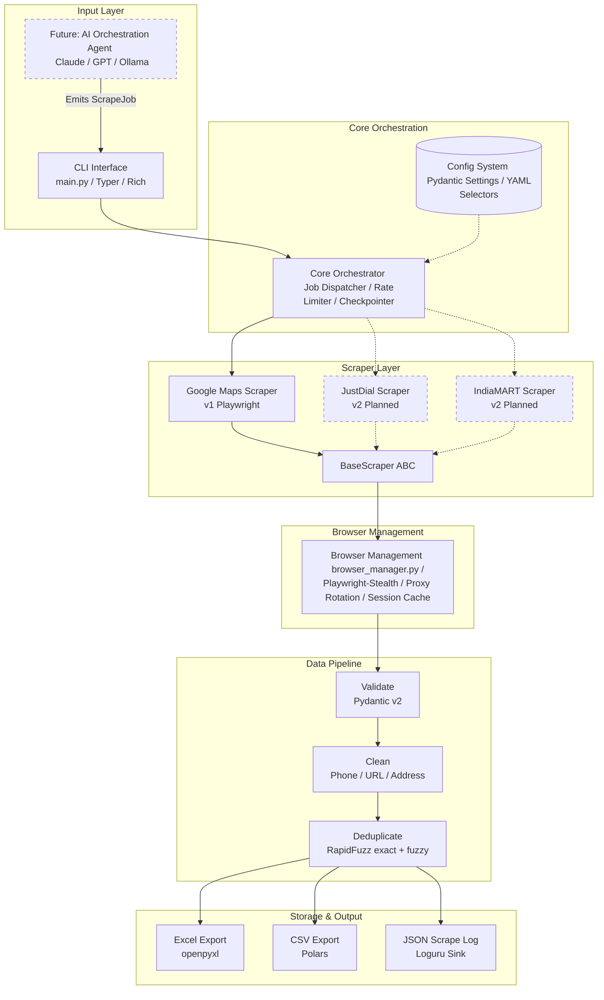

# LeadGen Scraper Platform: Architecture Breakdown

This document provides a comprehensive technical breakdown of the LeadGen Scraper Platform's architecture. It is designed to serve as the blueprint for development, ensuring all engineering decisions align with the resilience, anti-detection, and scalability requirements of the project.

---

## 1. Architectural Blueprint Overview

Based on the [leadgen_platform_architecture (1).png](file:///d:/scrapeit/Documentation/Architecture/leadgen_platform_architecture%20(1).png) diagram, the platform follows a layered, modular architecture with clear separation between user interface, core orchestration, browser automation, data processing, and storage.



---

## 2. Core Components Detail

### 2.1 CLI Interface (`main.py`)
*   **Technology Stack**: `Typer` + `Rich`.
*   **Role**: Serves as the user entry point. Typer parses command-line arguments using Python type hints, while Rich provides user-friendly feedback via real-time status spinners, progress bars, and formatted tables for results output.
*   **Design Goal**: Expose execution flags for target queries, geographical subdivisions, output destinations, proxy options, and concurrency limits.

### 2.2 Core Orchestrator
*   **Role**: Manages the lifecycle of a `ScrapeJob`. It handles:
    *   **Job Dispatch**: Translating user requests into scraper tasks.
    *   **Rate Limiting**: Orchestrating global delays between browser requests.
    *   **Continuous Checkpointing**: Writing scraped records directly to disk as they are retrieved, ensuring partial success is preserved in the event of crash or CAPTCHA blocking.
    *   **Geographic Subdivision**: Automatically expanding large-scale queries (e.g., city-wide) into micro-queries (e.g., suburb-wide) to bypass platform-specific listing limits.

### 2.3 Scraper Layer (`BaseScraper` ABC)
*   **Technology Stack**: Python standard `abc` (Abstract Base Classes) + `Playwright` (Async).
*   **Role**: Defines the standard interface for all search scrapers. 
    *   **`Google Maps Scraper` (V1)**: The primary driver, interacting with the Google Maps interface.
    *   **`JustDial` / `IndiaMART` (V2)**: Future targets that will inherit from `BaseScraper` and hook directly into the Orchestrator.

### 2.4 Browser Management (`browser_manager.py`)
*   **Technology Stack**: `Playwright` (Async) + `playwright-stealth`.
*   **Role**: Manages browser context, cookies, proxy profiles, and session caching.
*   **Anti-Fingerprinting**: Automatically applies standard stealth patches, implements User-Agent rotation, and introduces Gaussian jitter-based delays.

### 2.5 Data Pipeline
*   **Validation**: Uses **Pydantic v2** (`BusinessLead` model) to validate, serialize, and format fields.
*   **Cleaning**: Formats and normalizes telephone numbers (E.164), validates and sanitizes URLs, and standardizes mailing addresses.
*   **Deduplication**: Utilizes **Polars** for fast exact-match deduplication and **RapidFuzz** for fuzzy-match deduplication (matching similar business names/addresses across scrapers).

### 2.6 Storage Layer
*   **Polars**: Primary tool for processing high-volume datasets. Streamlines outputting to CSV.
*   **openpyxl**: Used for exporting polished Excel sheets (`.xlsx`) with formatting.
*   **Loguru**: Structured JSON log writer that maintains the execution trail (`scrape_log.json`).

---

## 3. Resolving Architectural & Operational Hard Choices

### 3.1 Overcoming the 120-Result Google Maps Hard Cap
Google Maps restricts listings to roughly 120 items per search query, regardless of viewport size or scroll depth. 
*   **Workaround: Geographic Subdivision**:
    *   Instead of running a broad search like `"Real Estate Developers Mumbai"`, the Orchestrator subdivides the query based on a pre-defined YAML list of micro-neighborhoods (e.g., `"Real Estate Developers Bandra"`, `"Real Estate Developers Andheri"`, `"Real Estate Developers Juhu"`).
    *   The results are crawled individually and compiled by the Orchestrator, which uses `Polars` and `RapidFuzz` to deduplicate businesses that cross neighborhood boundaries.

```
       [Parent Query: "Real Estate Developers Mumbai"]
                           |
            (Geographic Subdivision Engine)
                           |
   +-----------------------+-----------------------+
   |                       |                       |
["Real Estate... Bandra"] ["Real Estate... Andheri"] ["Real Estate... Juhu"]
   |                       |                       |
   v                       v                       v
[~120 Results]          [~120 Results]          [~120 Results]
   +-----------------------+-----------------------+
                           |
                  (Polars + RapidFuzz)
                           |
             [Deduplicated & Merged Dataset]
```

### 3.2 Evading Anti-Bot Systems
Dynamic browser fingerprinting easily catches standard Headless Chrome instances. We implement a multi-layered defense system:
1.  **Playwright-Stealth**: Modifies ~30 browser API fingerprint vectors (e.g., `navigator.webdriver`, WebGL vendor strings, canvas rendering) to match standard user browsers.
2.  **Gaussian Random Jitter**: Replaces uniform delays (`asyncio.sleep(2)`) with random distributions representing human pacing (e.g., standard deviation based on key interactions).
3.  **Human-like Scrolling**: Implements natural scroll acceleration, decelerating near listing elements, simulating cursor hovers, and backtracking periodically.

### 3.3 Protection Against Selector Drift
Google Maps class names change regularly. To prevent system failure:
*   No CSS selectors will be hardcoded in Python scraper code.
*   All selectors must be declared in external YAML configuration files (e.g., `selectors.yaml`).
*   The system loads these selectors at runtime, making them "hot-editable" without codebase redeployment.

### 3.4 Risk Exclusions: LinkedIn
Due to aggressive anti-scraping litigation and strict bot-detection mechanics (e.g., requiring logged-in sessions that risk actual user account bans), **LinkedIn extraction is excluded from V1/V2**.
*   The data model (`BusinessLead`) will support social links (including `linkedin_url`), but the scraper architecture is designed to omit direct LinkedIn crawling in initial releases.

### 3.5 Proxy Layer and Scale Design
IP bans are inevitable under sustained load.
*   `browser_manager.py` must support a clean `ProxySettings` interface from day one.
*   By default, it runs proxy-less, but includes built-in rotation options for standard HTTP/S and SOCKS5 residential proxy pools.

### 3.6 Continuous Checkpointing (Partial Success Preservation)
To prevent total loss of data when an IP is blocked or a CAPTCHA is served:
*   Scraped leads are validated and appended to a temporary checkpoint file (e.g., CSV/JSON Lines) incrementally.
*   Upon recovery or subsequent run, the orchestrator reads the checkpoint file to resume or merge data safely.

---

## 4. Proposed Data Model (`BusinessLead`)

Implemented using Pydantic v2, serving as the interface between the scraping modules and the storage pipelines.

```python
from typing import Optional, List
from pydantic import BaseModel, Field, HttpUrl, field_validator
import re

class BusinessLead(BaseModel):
    id: str = Field(description="Unique hash of business name and address to identify duplicates")
    name: str = Field(..., min_length=1)
    address: str = Field(..., min_length=1)
    city: str
    phone: Optional[str] = None
    website: Optional[HttpUrl] = None
    rating: Optional[float] = Field(None, ge=0.0, le=5.0)
    review_count: Optional[int] = Field(None, ge=0)
    category: Optional[str] = None
    latitude: Optional[float] = None
    longitude: Optional[float] = None
    social_links: List[HttpUrl] = []

    @field_validator("phone")
    @classmethod
    def normalize_phone(cls, v: Optional[str]) -> Optional[str]:
        if not v:
            return None
        # Remove spaces, dashes, parentheses
        digits = re.sub(r"\D", "", v)
        # If it matches standard format, convert to E.164 (simplified)
        if len(digits) == 10:
            return f"+91{digits}" # Defaulting to India country code for V1
        elif len(digits) > 10 and v.startswith("+"):
            return f"+{digits}"
        return v
```

---

## 5. Technology Stack Summary

| Layer | Library/Framework | Rationale |
| :--- | :--- | :--- |
| **Browser Automation** | `Playwright` (Async) | Native asyncio, handles dynamic pages, request interception, superior anti-detection support. |
| **Data Validation** | `Pydantic v2` | Fast type checking, data coercion, serialization, and clean validator API. |
| **Data Processing** | `Polars` | Blazing fast execution speeds (C++ engine), lazy execution, direct CSV/Parquet export. |
| **Retry Logic** | `Tenacity` | Exponential backoff, jitter support, custom exceptions, and clean decorator wrapper. |
| **CLI & UI** | `Typer` + `Rich` | Declarative command configuration with beautiful terminal layouts (spinners, tables). |
| **Logging** | `Loguru` | Out-of-the-box structured logging, log rotation, and contextual exception tracing. |
| **Configuration** | `Pydantic Settings` + `PyYAML` | Type-safe environment variable parsing paired with hot-editable YAML files. |
| **Fuzzy Matching** | `RapidFuzz` | Rapid Levenshtein distance calculations to spot near-duplicate leads. |
| **AI Layer (Future)** | `LiteLLM` | Unified API structure to switch seamlessly between Claude, OpenAI, and Ollama. |
