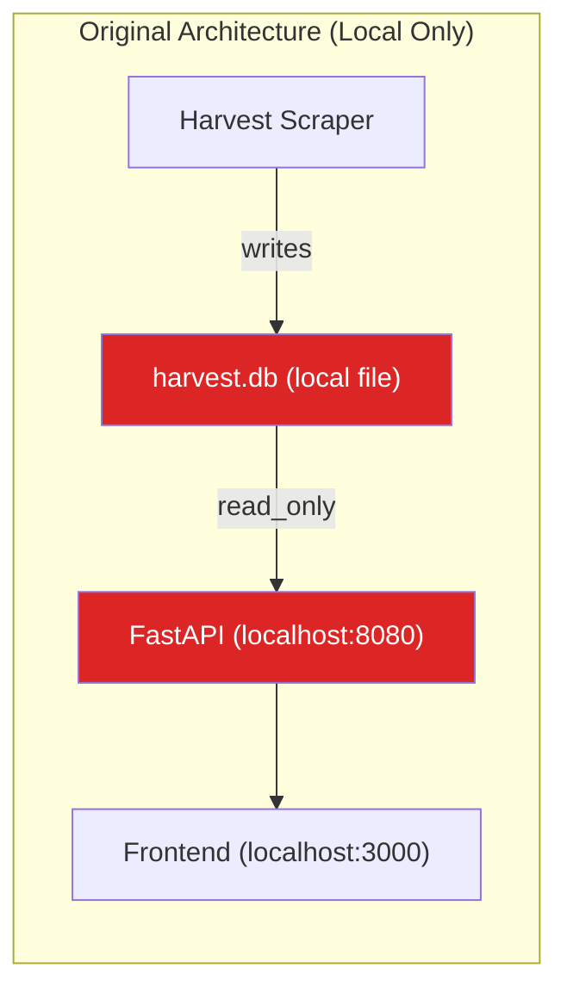
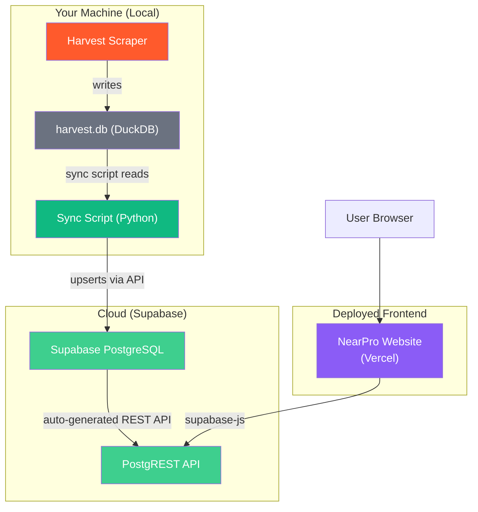

# NearPro v2 — Revised Architecture (Supabase + Cloud Deployment)

## Why This Document Exists

The [original NearPro architecture spec](file:///d:/scrapeit/Documentation/Architecture/nearpro_architecture_spec.md) was designed for **local use** — a FastAPI backend reading from a local DuckDB file. The user's intent has evolved:

> **NearPro is not a local tool. It's a deployed, public-facing web application** that:
> 1. Showcases MappCall's app benefits (marketing website layer)
> 2. Serves a data-powered professional directory (the app layer)
> 3. Is accessible from any device, anywhere — not just the machine running the scraper
> 4. Deploys as a static site on Vercel (free, zero-config, global CDN)

This fundamentally changes the data architecture. A local DuckDB file cannot serve a deployed web app. We need a cloud database that:
- Is accessible from any deployed frontend (Vercel)
- Has a built-in API layer (so we don't need to deploy a FastAPI server)
- Scales with users without managing infrastructure
- Has auth capabilities for future features (Claim Your Listing)

**Supabase is that answer.**

---

## The Core Problem: Why DuckDB Can't Work for Deployment



**Problems with deploying this:**

| Issue | Impact |
|---|---|
| DuckDB is a local file | Can't be accessed by a frontend on Vercel/Cloudflare |
| FastAPI needs a server | Requires a VPS (₹500-2000/mo), deployment, SSL, monitoring |
| No built-in auth | Need to build JWT/session management from scratch |
| No built-in API | Every endpoint is custom Python code to maintain |
| Single point of failure | If the server goes down, the app goes down |

---

## The Solution: Supabase as the Cloud Brain



### Why Supabase (and not Firebase, PlanetScale, or raw PostgreSQL)

| Factor | Supabase | Firebase | PlanetScale | Raw Postgres (VPS) |
|---|---|---|---|---|
| **PostgreSQL** | ✅ Full PostgreSQL | ❌ NoSQL (Firestore) | ✅ MySQL-based | ✅ Full PostgreSQL |
| **Auto REST API** | ✅ PostgREST built-in | ❌ SDK only | ❌ Need backend | ❌ Need backend |
| **No backend needed** | ✅ Frontend → DB directly | Partial | ❌ | ❌ |
| **Row Level Security** | ✅ Native PostgreSQL RLS | ✅ Rules | ❌ | ✅ But manual |
| **Auth (future)** | ✅ Built-in | ✅ Built-in | ❌ | ❌ Need to build |
| **Free tier** | 500MB, 50K MAU, 5GB egress | Limited | Gone (deprecated) | ₹500+/mo |
| **SQL queries from frontend** | ✅ RPC functions | ❌ | ❌ | ❌ |
| **JSONB support** | ✅ Native PostgreSQL | Nested documents | ❌ | ✅ |
| **Python client** | ✅ supabase-py | ✅ firebase-admin | ✅ | psycopg2 |

**Supabase wins because it eliminates the need for a FastAPI backend entirely.** The frontend talks directly to Supabase using `supabase-js`. Complex queries become PostgreSQL RPC functions.

---

## What This Changes (and What It Doesn't)

### What Changes

| Before (v1 spec) | After (v2 Supabase) | Why |
|---|---|---|
| FastAPI backend (custom Python API) | **Eliminated** — Supabase PostgREST is the API | Zero backend code to deploy/maintain |
| DuckDB (local file) | **Supabase PostgreSQL** (cloud) | Accessible from any deployed frontend |
| Frontend reads from localhost:8080 | **Frontend reads from Supabase directly** via `supabase-js` | No backend server needed |
| `api/routes/*.py` (6 custom endpoints) | **PostgreSQL RPC functions** + Supabase queries | Logic lives in the database, not a server |
| Deploy requires VPS + FastAPI + SSL | **Frontend on Vercel** (free, zero-config) | Static site hosting, globally distributed |
| No auth | **Supabase Auth** available for future Claim Your Listing | Built-in, no custom JWT code |

### What Stays the Same

| Item | Status | Reason |
|---|---|---|
| Harvest scraper | **Untouched** | Still writes to local DuckDB, still runs independently |
| `harvest.db` | **Still the source of truth** | Sync script reads FROM it |
| All 8 differentiator features | **All preserved** | Open Now, Completeness Score, AI Search, Compare, Heatmap, Export, Recently Added, QR |
| NearPro branding | **Same** | Name, colors, typography, S8N attribution |
| Category mapping logic | **Same** — moves into sync script + DB views | 11 parent groups, keyword matching |
| Geo utils (area extraction) | **Same** — moves into sync script | Pre-computed during sync, stored in DB |
| Critical constraints | **Same** | Never import from harvest/, read-only, 24 cards/page |

---

## S8N Brand Identity (Applied to NearPro UI)

> [!IMPORTANT]
> NearPro's UI must carry S8N's brand DNA — same dark premium aesthetic, same color language, same typography feel. When someone visits NearPro and then s8n.in, they should feel the family connection instantly.

### Color Palette (extracted from s8n.in)

| Token | Value | Usage |
|---|---|---|
| `--brand-gradient` | `linear-gradient(135deg, #ffa000, #ec4899)` | Primary CTA buttons, hero accents, active nav links |
| `--brand-gradient-hover` | `linear-gradient(135deg, #ffb333, #f062a8)` | Button hover states |
| `--accent-gold` | `#ffa000` | Active states, highlights, focus borders, icon tints |
| `--accent-pink` | `#ec4899` | Secondary accent, gradient endpoint, badges |
| `--bg-base` | `#09090b` | Page background (near-black) |
| `--bg-surface` | `#18181b` | Cards, modals, sidebar, elevated surfaces |
| `--bg-surface-hover` | `#27272a` | Card hover state, interactive surface |
| `--text-primary` | `#f4f4f5` | Headings, primary text (off-white) |
| `--text-secondary` | `#a1a1aa` | Body text, descriptions (muted gray) |
| `--text-muted` | `#52525b` | Labels, timestamps, tertiary info |
| `--border` | `#27272a` | Card borders, dividers |
| `--border-focus` | `#ffa000` | Input focus rings, active borders |

### Typography

| Element | Font | Fallback |
|---|---|---|
| Headings & display | **Space Grotesk** (or Clash Display) | `system-ui, sans-serif` |
| Body & descriptions | **Inter** | `system-ui, sans-serif` |
| Buttons, labels, mono | **JetBrains Mono** | `monospace` |

### Design Principles (from s8n.in)
- **Dark-first**: Near-black backgrounds with light text — premium, modern
- **Gradient accents**: Orange-gold → Pink gradient on CTAs and highlights
- **Glass cards**: Semi-transparent card surfaces with subtle borders
- **Minimal chrome**: Clean lines, generous spacing, no visual clutter
- **Subtle glow effects**: Gradient glow behind hero elements, card hover shadows with gold tint

### S8N Attribution (unchanged)
Footer: `NearPro — Made with ❤️ by S8N`
S8N appears nowhere else in the product.

---

## The Two-Layer Product

NearPro is actually **two things in one deployed site**:

### Layer 1: Marketing Website (Showcasing MappCall App)
- Hero section with MappCall value proposition
- Feature highlights (Explore, Digital Catalogue, Communication)
- Profession showcase grid (pulled from Supabase data)
- User testimonials
- App download CTAs (Play Store + App Store)
- "Powered by real Google Maps data" trust signal

### Layer 2: Professional Directory (The Intelligence App)
- Category sidebar → card grid → detail modal
- Map view with cluster pins (Leaflet.js)
- Search + AI search
- Filters (Open Now, rating, area, completeness)
- Compare, QR, Export
- Insights/Analytics page

**Both layers live on the same deployed site.** The marketing page is the homepage. Click "Browse Professionals" → enters the directory app.

---

## New Data Pipeline

### Step 1: Harvest Scraper (Unchanged)
```
Scraper runs locally → writes to harvest.db → exports to Google Sheets
```
This is already happening. No changes.

### Step 2: Sync Script (NEW — runs locally alongside scraper)
```
Reads from harvest.db (DuckDB, read-only)
↓
Transforms data:
  - Applies category_mapping → parent_category field
  - Applies geo_utils → area field
  - Computes completeness_score
  - Parses hours → structured JSONB
↓
Upserts to Supabase PostgreSQL via supabase-py
  - Uses dedup_hash as conflict key → prevents duplicates
  - New leads are inserted, existing leads are updated
```

**When does sync run?**
- Option A: Triggered manually after a scrape batch completes
- Option B: Scheduled via Windows Task Scheduler (e.g., every 6 hours)
- Option C: Called from the SheetScheduler after each successful job

### Step 3: Frontend (Deployed)
```
supabase-js client → Supabase PostgREST API → PostgreSQL
```
No middleman. No FastAPI. No server to maintain.

---

## Supabase Database Schema

### Table: `professionals`

```sql
CREATE TABLE professionals (
    -- Identity
    id              UUID PRIMARY KEY DEFAULT gen_random_uuid(),
    harvest_id      TEXT UNIQUE NOT NULL,     -- Original ID from harvest.db
    dedup_hash      TEXT UNIQUE NOT NULL,     -- For upsert conflict resolution
    
    -- Core Business Info
    name            TEXT NOT NULL,
    category        TEXT,                     -- Raw Google Maps category
    parent_category TEXT,                     -- Computed: "Healthcare", "Beauty", etc.
    address         TEXT,
    area            TEXT,                     -- Computed: "Bandra", "Andheri", etc.
    phone           TEXT,
    website         TEXT,
    email           TEXT,
    
    -- Quality Signals
    rating          REAL,
    review_count    INTEGER,
    completeness_score INTEGER DEFAULT 0,    -- 0-5 computed score
    
    -- Temporal
    hours           JSONB,                   -- {"Mon": "9am-6pm", ...}
    
    -- Geospatial
    latitude        REAL,
    longitude       REAL,
    
    -- Source & Metadata
    source          TEXT NOT NULL DEFAULT 'google_maps',
    source_url      TEXT,
    scraped_at      TIMESTAMPTZ NOT NULL,
    synced_at       TIMESTAMPTZ DEFAULT NOW(),
    
    -- Raw payload (for future enrichment)
    raw_data        JSONB DEFAULT '{}'::jsonb,
    
    -- Indexes
    CONSTRAINT unique_dedup UNIQUE (dedup_hash)
);

-- Performance indexes
CREATE INDEX idx_prof_category ON professionals(parent_category);
CREATE INDEX idx_prof_area ON professionals(area);
CREATE INDEX idx_prof_rating ON professionals(rating DESC);
CREATE INDEX idx_prof_scraped ON professionals(scraped_at DESC);
CREATE INDEX idx_prof_completeness ON professionals(completeness_score DESC);
CREATE INDEX idx_prof_phone ON professionals(phone);
CREATE INDEX idx_prof_name_trgm ON professionals USING gin(name gin_trgm_ops);

-- Enable trigram extension for fuzzy text search
CREATE EXTENSION IF NOT EXISTS pg_trgm;
```

### Row Level Security (RLS)

```sql
-- Enable RLS
ALTER TABLE professionals ENABLE ROW LEVEL SECURITY;

-- Public read access (anyone can browse the directory)
CREATE POLICY "Public read access" ON professionals
    FOR SELECT
    USING (true);

-- Only service role can insert/update (sync script uses service key)
CREATE POLICY "Service role write access" ON professionals
    FOR ALL
    USING (auth.role() = 'service_role');
```

### RPC Functions (Replace FastAPI Endpoints)

```sql
-- 1. Stats endpoint (replaces GET /api/stats)
CREATE OR REPLACE FUNCTION get_stats()
RETURNS JSON AS $$
    SELECT json_build_object(
        'total_professionals', COUNT(*),
        'total_categories', COUNT(DISTINCT category),
        'total_areas', COUNT(DISTINCT area),
        'average_rating', ROUND(AVG(rating)::numeric, 1),
        'with_phone', COUNT(phone),
        'with_website', COUNT(website),
        'with_email', COUNT(email),
        'with_coordinates', COUNT(latitude),
        'last_scraped', MAX(scraped_at),
        'freshness', json_build_object(
            'last_7_days', COUNT(*) FILTER (WHERE scraped_at > NOW() - INTERVAL '7 days'),
            'last_30_days', COUNT(*) FILTER (WHERE scraped_at > NOW() - INTERVAL '30 days'),
            'older', COUNT(*) FILTER (WHERE scraped_at <= NOW() - INTERVAL '30 days')
        )
    )
    FROM professionals;
$$ LANGUAGE SQL STABLE;

-- 2. Category groups (replaces GET /api/categories)
CREATE OR REPLACE FUNCTION get_category_groups()
RETURNS JSON AS $$
    SELECT json_agg(row_to_json(t))
    FROM (
        SELECT 
            parent_category as name,
            COUNT(*) as total,
            MAX(scraped_at) as last_updated,
            json_agg(json_build_object(
                'name', category,
                'slug', LOWER(REPLACE(category, ' ', '-')),
                'count', sub_count
            ) ORDER BY sub_count DESC) as subcategories
        FROM (
            SELECT parent_category, category, COUNT(*) as sub_count
            FROM professionals
            WHERE parent_category IS NOT NULL
            GROUP BY parent_category, category
        ) sub
        GROUP BY parent_category
        ORDER BY total DESC
    ) t;
$$ LANGUAGE SQL STABLE;

-- 3. Area insights (replaces GET /api/insights)
CREATE OR REPLACE FUNCTION get_area_insights()
RETURNS JSON AS $$
    SELECT json_build_object(
        'area_density', (
            SELECT json_agg(row_to_json(t))
            FROM (
                SELECT area, COUNT(*) as count, 
                       COUNT(DISTINCT category) as categories,
                       ROUND(AVG(rating)::numeric, 1) as avg_rating
                FROM professionals
                WHERE area IS NOT NULL
                GROUP BY area
                ORDER BY count DESC
            ) t
        ),
        'category_distribution', (
            SELECT json_agg(row_to_json(t))
            FROM (
                SELECT parent_category as category, COUNT(*) as count,
                       ROUND(COUNT(*)::numeric / (SELECT COUNT(*) FROM professionals) * 100, 1) as percentage
                FROM professionals
                GROUP BY parent_category
                ORDER BY count DESC
            ) t
        )
    );
$$ LANGUAGE SQL STABLE;
```

### How supabase-js Replaces FastAPI Endpoints

| FastAPI Endpoint (v1) | Supabase JS Equivalent (v2) |
|---|---|
| `GET /api/stats` | `supabase.rpc('get_stats')` |
| `GET /api/categories` | `supabase.rpc('get_category_groups')` |
| `GET /api/professionals?category=dentist&area=bandra&min_rating=4&limit=24&offset=0` | `supabase.from('professionals').select('*', { count: 'exact' }).eq('parent_category', 'Healthcare').ilike('category', '%dentist%').ilike('area', '%Bandra%').gte('rating', 4).order('rating', { ascending: false }).range(0, 23)` |
| `GET /api/professionals/{id}` | `supabase.from('professionals').select('*').eq('id', id).single()` |
| `GET /api/professionals/search?q=sharma` | `supabase.from('professionals').select('*').or('name.ilike.%sharma%,address.ilike.%sharma%,category.ilike.%sharma%').range(0, 23)` |
| `GET /api/insights` | `supabase.rpc('get_area_insights')` |

**Every single FastAPI endpoint is replaced by a 1-liner in JavaScript.** Zero backend code.

---

## Sync Script Design

### File: `d:\scrapeit\nearpro\sync\sync_to_supabase.py`

```python
"""
Syncs leads from local Harvest DuckDB to Supabase PostgreSQL.
Reads DuckDB in read-only mode. Upserts to Supabase using dedup_hash.
Run after each scrape batch or on a schedule.
"""
```

**What it does:**
1. Opens `harvest.db` in `read_only=True` mode
2. Queries all leads (or new leads since last sync using `scraped_at > last_sync`)
3. For each lead:
   - Applies `category_mapping.get_parent_category()` → `parent_category`
   - Applies `geo_utils.extract_area()` → `area`
   - Computes `completeness_score` (phone +1, website +1, email +1, hours +1, coords +1)
   - Serializes `hours` and `raw_data` as JSON
4. Upserts to Supabase `professionals` table using `dedup_hash` as conflict key
5. Logs: "Synced 247 new leads, updated 12 existing. Total in Supabase: 2,847"

**Incremental sync:** Stores `last_sync_timestamp` in a local `.sync_state` file. Only processes leads where `scraped_at > last_sync_timestamp`. First run syncs everything.

### Dependencies
- `supabase` (Python client)
- `duckdb` (read-only connection)
- `python-dotenv` (env config)

### Environment Variables
```env
NEARPRO_SUPABASE_URL=https://your-project.supabase.co
NEARPRO_SUPABASE_SERVICE_KEY=eyJhbGciOiJIUzI1NiIsInR5cCI6IkpXVCJ9...
NEARPRO_DB_PATH=../.harvest/harvest.db
```

> [!WARNING]
> The `SERVICE_KEY` is used by the sync script (server-side, never exposed to the browser). The frontend uses the `ANON_KEY` which has read-only access through RLS policies.

---

## Revised Folder Structure

```
d:\scrapeit\nearpro\                ← NEW project root
│
├── sync/                            ← Data pipeline (local → cloud)
│   ├── sync_to_supabase.py          ← Main sync script
│   ├── category_mapping.py          ← Google Maps → parent category mapping
│   ├── geo_utils.py                 ← Address → area extraction
│   └── .sync_state                  ← Last sync timestamp (gitignored)
│
├── supabase/                        ← Database setup scripts
│   ├── schema.sql                   ← CREATE TABLE + indexes + RLS
│   ├── rpc_functions.sql            ← get_stats, get_category_groups, etc.
│   └── seed_test_data.sql           ← Optional test data for dev
│
├── frontend/                        ← Deployed web application
│   ├── index.html                   ← App shell (marketing + directory)
│   ├── vite.config.js               ← Build config
│   ├── package.json                 ← supabase-js, leaflet, chart.js, qrcode
│   ├── css/
│   │   ├── style.css                ← Design system
│   │   ├── layout.css               ← Grid, sidebar, responsive
│   │   ├── components.css           ← Cards, modals, badges
│   │   ├── marketing.css            ← Hero, features, testimonials
│   │   └── map.css                  ← Leaflet customizations
│   └── js/
│       ├── app.js                   ← Main entry, router
│       ├── supabase.js              ← Supabase client init (ANON key only)
│       ├── state.js                 ← Global state + pub/sub
│       ├── router.js                ← Hash-based routing
│       └── components/
│           ├── MarketingHero.js      ← Landing page hero section
│           ├── FeatureShowcase.js    ← MappCall app features
│           ├── Header.js             ← Sticky nav with search
│           ├── CategorySidebar.js    ← Collapsible category tree
│           ├── ProfessionalCard.js   ← Card with completeness, open-now
│           ├── ProfessionalModal.js  ← Full detail + CTAs
│           ├── MapView.js            ← Leaflet map + clusters
│           ├── SearchBar.js          ← Standard + AI search
│           ├── FilterPanel.js        ← Rating, open now, area, sort
│           ├── CompareModal.js       ← Side-by-side comparison
│           ├── InsightsPage.js       ← Charts + heatmap
│           ├── QRCodeModal.js        ← QR code generation
│           └── ExportButton.js       ← Multi-select + export
│
├── tests/
│   ├── test_sync.py                 ← Sync script tests
│   ├── test_categories.py           ← Category mapping tests
│   └── test_geo.py                  ← Area extraction tests
│
├── .env                             ← Supabase keys (gitignored)
├── .env.example                     ← Template with placeholder values
├── pyproject.toml                   ← Python deps (sync script)
├── README.md
└── start_sync.py                    ← One-command sync launcher
```

### What's Gone (vs v1)
- ❌ `api/` folder — **eliminated entirely**. No FastAPI, no uvicorn, no custom Python API.
- ❌ `api/server.py`, `api/routes/*.py`, `api/models.py`, `api/db.py` — all replaced by Supabase.
- ❌ `start.py` (API launcher) — replaced by `start_sync.py` (sync script only)
- ❌ `pyproject.toml` FastAPI/uvicorn deps — replaced by supabase-py/duckdb only

### What's New (vs v1)
- ✅ `sync/` folder — the data bridge between local scraper and cloud
- ✅ `supabase/` folder — SQL schema, RPC functions, migrations
- ✅ `frontend/js/supabase.js` — Supabase client initialization
- ✅ `frontend/css/marketing.css` — Marketing/landing page styles
- ✅ `frontend/js/components/MarketingHero.js` + `FeatureShowcase.js` — App showcase components

---

## Deployment Strategy

### Frontend: Vercel (Free)

```
GitHub repo → Push to main → Auto-deploy on Vercel
```

| Resource | Free Limit |
|---|---|
| Bandwidth | 100 GB/mo |
| Build minutes | 6,000/mo |
| Preview deploys | Every PR gets unique URL |
| Custom domain | ✅ Free SSL |
| CDN | Global (Mumbai PoP) |
| Serverless functions | Available if ever needed |

**Why Vercel**: Simplest setup (connect GitHub, done), best preview deploys, 6x more build minutes than alternatives, 100GB bandwidth is more than enough for a directory app.

### Database: Supabase Free Tier

| Resource | Free Limit | Our Usage (est.) |
|---|---|---|
| Database storage | 500 MB | ~10-50 MB (3K-10K professionals) |
| Monthly active users | 50,000 | Well under |
| Edge function invocations | 500,000/mo | Not using edge functions |
| Egress | 5 GB/mo | Well under for directory |
| Active projects | 2 | Using 1 |

**500 MB easily holds 50,000+ professional records with all JSONB fields.** Mumbai data will be ~5-15 MB. Even all of India won't hit this limit.

### Total Deployment Cost: ₹0

| Component | Cost |
|---|---|
| Supabase (database + API) | Free |
| Vercel (frontend hosting) | Free |
| Domain (nearpro.in) | ~₹600/year (if purchased) |
| SSL certificate | Free (Cloudflare) |
| **Total monthly** | **₹0** (+ optional ₹50/mo for domain) |

---

## Build Phases (Revised)

### Phase 0: Supabase Setup
1. Create Supabase project (free tier)
2. Run `supabase/schema.sql` — creates `professionals` table + indexes + RLS
3. Run `supabase/rpc_functions.sql` — creates get_stats, get_category_groups, etc.
4. Note down `SUPABASE_URL` and `SUPABASE_ANON_KEY` (public, for frontend)
5. Note down `SUPABASE_SERVICE_KEY` (private, for sync script)
6. **Verify**: Open Supabase dashboard → Table Editor shows empty `professionals` table

### Phase 1: Sync Script
1. Create `sync/category_mapping.py` (from original spec §5)
2. Create `sync/geo_utils.py` (from original spec §6)
3. Create `sync/sync_to_supabase.py` — DuckDB reader + transformer + Supabase upserter
4. Create `tests/test_sync.py`, `test_categories.py`, `test_geo.py`
5. Run sync: `python start_sync.py`
6. **Verify**: Supabase dashboard shows real data from harvest.db
7. **Verify**: `supabase.rpc('get_stats')` returns real numbers
8. **Verify**: `supabase.from('professionals').select('*').limit(3)` returns real records

### Phase 2: Core Frontend (Marketing + Directory Grid)
1. Frontend scaffold (index.html, vite.config.js, package.json)
2. `js/supabase.js` — client init with ANON key
3. CSS design system (style.css, layout.css, components.css, marketing.css)
4. `MarketingHero.js` + `FeatureShowcase.js` — landing page
5. `state.js`, `router.js`
6. `CategorySidebar.js`, `ProfessionalCard.js`, `Header.js`
7. `app.js` — wire everything
8. **Verify**: Landing page renders → click "Browse" → directory loads from Supabase

### Phase 3: Detail Modal + Map View
1. `ProfessionalModal.js` — hours table, all fields, 3 CTAs
2. `MapView.js` — Leaflet + MarkerCluster
3. View toggle (Grid / Map) in Header
4. **Verify**: Click pin → popup → modal → CTAs work

### Phase 4: Differentiator Features
1. `SearchBar.js` — standard + AI mode
2. `FilterPanel.js` — rating, open now, area, sort
3. `CompareModal.js` — side-by-side
4. `InsightsPage.js` — Chart.js + Leaflet choropleth
5. `QRCodeModal.js` — client-side QR
6. `ExportButton.js` — multi-select (webhook or download CSV)

### Phase 5: Deploy
1. Push to GitHub repository
2. Connect to Vercel (import project, auto-detects Vite)
3. Set env vars: `VITE_SUPABASE_URL`, `VITE_SUPABASE_ANON_KEY`
4. Custom domain (nearpro.in)
5. **Verify**: Public URL serves the full app with live Supabase data

---

## Critical Constraints (Updated)

| # | Constraint |
|---|---|
| 1 | **Never import from `harvest/`** — sync script reads DuckDB directly, no Python imports |
| 2 | **Never expose `SERVICE_KEY`** — frontend uses `ANON_KEY` only, sync uses `SERVICE_KEY` |
| 3 | **Never touch `main.py`, `harvest/`, or `config/`** — scraper stays untouched |
| 4 | **RLS enforced** — public users can only SELECT, sync script uses service role for writes |
| 5 | **All times in IST** — `scraped_at` stored as UTC in Supabase, converted in frontend |
| 6 | **No paid APIs** — Leaflet, Chart.js, qrcode.js — all free, all client-side |
| 7 | **Graceful empty state** — if no data synced yet, show "Coming soon" not errors |
| 8 | **24 cards per page** — `.range(0, 23)` in Supabase queries |
| 9 | **Dedup on sync** — `ON CONFLICT (dedup_hash) DO UPDATE` prevents duplicates |
| 10 | **Incremental sync** — only push new/updated leads, not full table replace |

---

## Future Scope (Enabled by Supabase)

| Feature | How Supabase Enables It |
|---|---|
| **Claim Your Listing** | Supabase Auth → user signs up → linked to professional row |
| **WhatsApp CTA** | Just a `wa.me/{phone}` link — no backend needed |
| **User Reviews** | New `reviews` table with foreign key to `professionals` + RLS |
| **MappCall Install Tracking** | `click_events` table, insert on CTA click via supabase-js |
| **Multi-City Expansion** | Sync script processes Pune/Delhi data → same Supabase table |
| **Admin Dashboard** | Supabase Studio is already a built-in admin panel |
| **Real-time Updates** | Supabase Realtime → WebSocket subscriptions for live data |
| **API for Partners** | PostgREST is already a public API — just add API key auth |

---

*End of NearPro v2 Architecture — Supabase Edition*
*Scraper untouched. Data synced. Backend eliminated. Deployed for free.*
