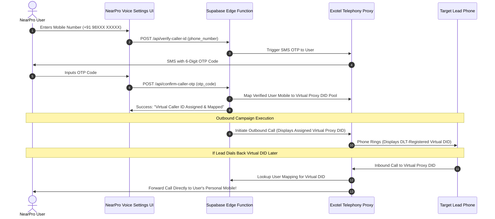
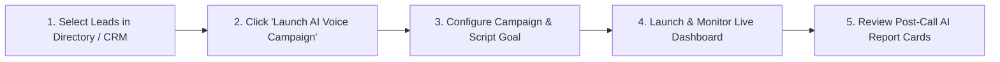

# NearPro AI Voice Agent — User Flow, Number Masking & Post-Call Deliverables Specification
## Version 2.0 | Production Audit Fixes, Number Masking Proxy, Upfront AI Disclosure & Campaign Ledger
## July 2026

---

## 1. REALISTIC PRODUCT POSITIONING & VALUE PROPOSITION

### Why We NEVER Claim "100% Conversion"
Promising a "100% conversion rate" on cold or warm business outreach is an unrealistic claim that destroys trust with agency owners and sales professionals. In Indian B2B outreach:
- **Cold Answer Rate**: 12% – 22% of phone calls are answered on 140-series commercial DIDs.
- **Answered Call Qualification Rate**: 15% – 30% of answered calls convert into interested prospects.

### How NearPro Positions the AI Voice Agent
Instead of promising false conversion guarantees, NearPro positions the AI Voice Agent as an **Automated Sales Qualifier & Time Multiplier**:

1. ⚡ **90% Manual Time Savings**: Replaces 20+ hours of tedious phone dialing every week with 1-click automated background campaigns.
2. 🎯 **The Ultimate Lead Filter**: Instantly dials 100 leads in the background and filters out non-working numbers, voicemails, and uninterested contacts, delivering only the **top 5–10 HOT prospects** into the user's pipeline.
3. 🔥 **Zero-Effort Warm Handoff**: NearPro users only spend their valuable time talking to pre-qualified business owners who already expressed interest during the AI call.

---

## 2. CALLER ID ARCHITECTURE — VIRTUAL NUMBER PROXY & DYNAMIC CALLBACK MASKING

> **Regulatory Compliance Note**: Under DoT / Indian Telegraph Act rules, setting arbitrary CLI (Caller Line Identification) on SIP trunks is illegal CLI spoofing. NearPro utilizes **Exotel / Twilio Virtual DIDs with Dynamic Number Masking & Callback Proxying**.



### Key Number Masking Rules:
1. **No CLI Spoofing**: Outbound calls use DLT-registered virtual DIDs provisioned by Exotel.
2. **Dynamic Inbound Routing**: If a lead dials back the virtual DID shown on their phone screen, Exotel's proxy server instantly forwards the PSTN call to the NearPro user's verified mobile number.
3. **DID Pool Rotation (Spam Mitigation)**: NearPro maintains a pool of 10 virtual DIDs per campaign to prevent Truecaller / Carrier "Spam Likely" flagging.

---

## 3. UPFRONT AI DISCLOSURE & RECORDING CONSENT SCRIPT

Under TRAI disclosure norms and **DPDP Act 2023 data processing rules**, every call must disclose AI automation and recording within the first 5 seconds:

```
[0:00 - 0:05 OPENER SCRIPT]
"Namaste! Kya meri baat [Lead Name / Owner] ji se ho rahi hai? 
Main NearPro ki automated AI assistant Priya bol rahi hoon on behalf of [Caller Company]. 
Yeh call quality aur training ke liye record ho rahi hai..."
```

### Language Precedence Rule
1. **Highest Precedence**: Explicit user selection in the Campaign Drawer (`English`, `Hinglish`, `Marathi/Hinglish`, `Hindi`).
2. **Secondary Fallback**: Automated Geo-Area Prefix Auto-Detect (e.g. Mumbai/Delhi → Hinglish; Pune → Marathi/Hinglish; Bangalore → English/Regional).
3. **Default**: Hinglish.

---

## 4. STEP-BY-STEP USER JOURNEY IN NEARPRO PORTAL



### Step 1: Lead Selection
- User multi-selects 5, 20, or 100 verified leads in NearPro Directory (`/directory`) or CRM (`/lead-crm`).

### Step 2: Campaign Launch Trigger
- User clicks: **`📞 Launch AI Voice Calling Campaign`**.

### Step 3: Campaign Configuration Drawer
User selects:
- **Campaign Name**: e.g., *"Bandra Dentists Growth Outreach"*.
- **Script Persona Goal**:
  - `Option A`: Quick Qualification (Check if accepting new clients).
  - `Option B`: Direct Demo Booking (Schedule a 10-min website/GMB audit call).
- **Language Precedence**: `Auto-Detect (Recommended)` | `Hinglish` | `Marathi/Hinglish` | `English`.
- **TTS Engine**: `Cartesia Sonic (High Fidelity)` | `Kokoro-82M (Cost-Optimized)`.

### Step 4: Live Campaign Monitoring Dashboard
- **Live Status Cards**: Shows `Queued (15)`, `Dialing (1)`, `Answered (3)`, `Completed (8)`.
- **Live WebRTC Listen Mode (Optional)**: A **"🎧 Listen Live"** button allows the NearPro user to listen silently in real-time to active calls.

---

## 5. POST-CALL DELIVERABLES & AI REPORT CARD

Within **3 seconds** of a call ending, NearPro generates an **AI Call Report Card** attached to the lead row in `LeadCRM.js`:

```
┌─────────────────────────────────────────────────────────────────────────┐
│  📞 AI CALL REPORT CARD — Dr. Amit's The Smile Centre                    │
│  Campaign: Bandra Dentists Outreach | Duration: 1m 42s | Credits: 1    │
│                                                                         │
│  AI QUALIFICATION RATING:  🔥 HOT LEAD (Requested Demo Meeting)          │
│  SENTIMENT SCORE:         88/100 Positive & Highly Engaged               │
│                                                                         │
│  AUDIO RECORDING (90-Day DPDP Retention)                                │
│  ► [▶ Play Audio 0:00 / 1:42]  [1.0x ▾]  [⬇ Download MP3]              │
│                                                                         │
│  KEY EXTRACTED INSIGHTS                                                 │
│  ──────────────────────                                                 │
│  • Current Pain Point: Missing direct calls from Google Maps search     │
│  • Booked Demo Slot:   Next Tuesday, Aug 4 @ 5:00 PM IST                │
│  • Contact Person:     Dr. Amit Sharma (Owner)                          │
│  • Next Recommended:   Send calendar invite on WhatsApp                 │
│                                                                         │
│  INTERACTIVE TRANSCRIPT                                                 │
│  ──────────────────────                                                 │
│  [0:04] AI (Priya): "Namaste! Kya meri baat Dr. Amit ji se ho rahi hai?"│
│  [0:08] Lead:       "Haan bol raha hoon, kaun?"                         │
│  [0:12] AI (Priya): "Main NearPro ki AI assistant Priya bol rahi hoon..."│
│  [0:45] Lead:       "Achha, demo kab hai?"                              │
│  [1:15] AI (Priya): "Tuesday shaam 5 baje slot book karoon?"            │
│  [1:22] Lead:       "Haan 5 baje chalega, WhatsApp pe bhej do."         │
│                                                                         │
│  ACTIONS                                                                │
│  [💬 Send 1-Click WhatsApp Confirmation]  [📅 Add to Calendar]           │
└─────────────────────────────────────────────────────────────────────────┘
```

---

## 6. SUMMARY OF PRODUCT DELIVERABLES

| Feature | What NearPro Delivers |
| :--- | :--- |
| **Number Setup** | Virtual Proxy DID mapping with 6-digit SMS OTP. Inbound callbacks route to user's phone. |
| **Spam Protection** | DID Pool Rotation (10 DIDs per campaign) + Truecaller Enterprise Header registration. |
| **Compliance** | Upfront AI disclosure + recording notice in first 5 seconds + DPDP 90-day retention policy. |
| **Outreach Execution** | 1-Click bulk AI calling from directory or CRM with smart business hours scheduling. |
| **Post-Call Output** | Instant MP3 recording, transcript timeline, AI hot lead score, and 1-click WhatsApp booking confirmation. |
